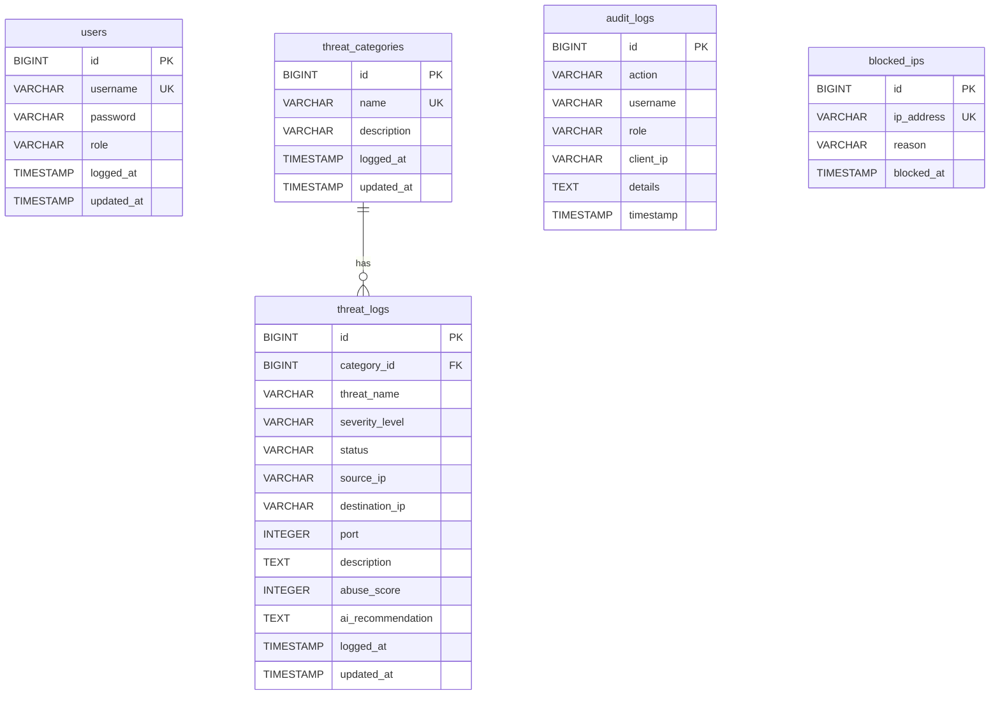

# 🛡️ Security Threat Archive (보안 위협 아카이브)

> **인공지능(Gemini AI) 및 위협 인텔리전스(Threat Intelligence)가 융합된 실시간 보안 침해 사고 기록, 분석 및 대응(SOAR) 플랫폼**
> 
> 본 프로젝트는 기업의 보안 관제 센터(SOC) 및 보안 팀이 네트워크 상에서 발생하는 다양한 침해 사고를 실시간으로 수집·기록하고, 외부 평판 데이터 조회(AbuseIPDB) 및 AI 조치 권고사항(Mitigation Playbook) 자동 생성을 통해 신속하게 침해 대응(Incident Response)을 수행할 수 있도록 돕는 관제 지원 솔루션입니다. 나아가 **SOAR 기반의 원클릭 방화벽 IP 차단 연동** 및 **AOP 감사 로그** 기능을 통해 실무급 보안 관제 기능을 실현합니다.

🎵 **Development Note (Vibe Coding)**
* 본 프로젝트는 인공지능과 대화하며 소프트웨어를 구축하는 **'바이브 코딩(Vibe Coding)'의 개념을 탐구하고 학습하기 위한 공부 용도**로 기획 및 진행되었습니다.
* 프로젝트의 기획, 요구사항 구체화, DB 모델링, 백엔드 로직 설계, 보안 기능(JWT), 실시간 스트리밍(SSE), 외부 API 연동, UI/UX 수정 및 로컬 실행 구동에 이르기까지 **모든 개발 빌드 과정은 순수하게 바이브 코딩(Vibe Coding)만을 이용하여 100% 진행**되었습니다.

---

## 🖥️ 서비스 미리보기 & UI 레이아웃

* **인터랙티브 대시보드 요약 캐러셀 (Dashboard Carousel)**: Framer Motion 물리 애니메이션과 아크 궤적 알고리즘을 이식한 스위처를 통해 **전체보기(🌐), 지표 요약(📊), 카테고리(📁), 심각도(📈)** 통계 화면을 유연한 슬라이드 및 동적 높이 밸런스(Auto height)로 전환하며 조회.
* **대시보드 통계 & 인터랙티브 차트**: Recharts를 활용해 전체 위협 수준, 실시간 등급별/카테고리별 통계 및 공격 추이 시각화.
* **아코디언 드롭다운 상세 보기**: 각 로그 항목 클릭 시 테이블 내에서 슬라이드 오픈되며 **상세 기술 분석 내용**, **AbuseIPDB 악성도 점수**, 및 **AI 대응 가이드** 출력.
* **SOAR 원클릭 차단**: 상세 보기 내 'IP 차단' 버튼 클릭 시, 해당 IP를 방화벽 차단 목록(`blocked_ips`)에 등록하고 해당 IP의 위협 로그 상태를 `BLOCKED`로 일괄 변경.
* **실시간 필터링**: 전체 심각도 및 등록된 카테고리를 활용해 화면 갱신 없이 실시간으로 조건별 로그 검색.
* **보안 보고서 다운로드**: 한글 깨짐이 없는 UTF-8 BOM 방식의 CSV는 물론, Apache POI 및 OpenPDF를 활용한 **Excel 및 PDF 형식의 고품질 보안 보고서** 추출 기능 지원.

---

## 🛠️ Technology Stack (기술 스택)

### Backend
* **Language & Runtime**: Java 21 (JDK 21)
* **Framework**: Spring Boot 4.1.0
* **Security**: Spring Security & JJWT 0.12.5 (JSON Web Token 기반 권한 제어)
* **Aspect (AOP)**: Spring AOP (행위자 감사 로그 수집 및 추적)
* **Data Access**: Spring Data JPA, Hibernate
* **Database**: MariaDB 11.x (Connector/J)
* **Libraries**: 
  * `RestTemplate` (외부 API 통신)
  * `Apache POI 5.2.5` (Excel 보고서 생성)
  * `OpenPDF 2.0.1` (PDF 보고서 생성)
* **Ingestion Channels**: Syslog UDP Server (기본 포트: 1514), Webhook API (HTTP POST)

### Frontend
* **Core**: React 19 / TypeScript / Vite 8
* **Styling**: Vanilla CSS (CSS Variables, Glassmorphism, Responsive Grid System)
* **Real-time Pipeline**: EventSource (Server-Sent Events)
* **Interceptors**: Native Fetch API Interceptor (JWT Token Auto-Inject & 401 Authentication Handler)
* **Libraries**: 
  * Recharts (인터랙티브 대시보드 차트)
  * Framer Motion (물리 기반 슬라이딩 대시보드 캐러셀)
* **Linter**: oxlint (초고속 코드 린팅)

### AI & Threat Intelligence API
* **AI Engine**: Google Gemini 1.5 Flash API (Stable v1)
* **Reputation Intelligence**: AbuseIPDB API v2 (Check API Endpoint)

---

## 💡 Key Features & Implementation Intent (핵심 기능 및 구현 의도)

### 1. 데이터 모델 및 관제 메타데이터 세분화 (DB & Modeling)
* **구현 의도**: 실제 보안 사고 기록으로 가치를 갖기 위해 단순 줄글 형태의 로그에서 탈피하여 출발지/목적지 IP, 포트, 처리 상태(`DETECTED`, `ANALYZING`, `RESOLVED`, `FALSE_POSITIVE`, `BLOCKED`) 등의 핵심 메타데이터를 추가 구축했습니다.
* **성능 최적화**: 위협 로그와 카테고리 테이블 조회 시 JPA Fetch Join 연산을 사용해 다대일 관계에서 흔히 발생하는 **N+1 쿼리 조회 성능 저하 문제**를 근본적으로 해결했습니다.

### 2. Spring Security & JWT 기반 권한 제어 (RBAC)
* **구현 의도**: 보안 데이터의 무결성을 지키고 불필요한 노출을 막기 위해 역할 기반 접근 제어(Role-Based Access Control)를 구현했습니다.
* **역할군 설계**:
  * `ROLE_ADMIN` (관리자): 위협의 입력, 수정, 삭제뿐 아니라 카테고리 설정까지 포함한 전체 CRUD 및 시스템 통제 권한 보유.
  * `ROLE_ANALYST` (분석가): 위협 로그의 조회, 입력, 수정 권한을 보유하며, 데이터 삭제 및 시스템 카테고리 관리는 불허.
  * `ROLE_USER` (조회 전용): 대시보드 화면 및 필터링 기능 조회를 허용하나, 등록 폼 및 제어 버튼은 UI에서 격리.

### 3. 실시간 SSE 동기화 및 알림 파이프라인 (SSE Real-Time Sync)
* **구현 의도**: 초 단위로 흘러가는 보안 관제 환경에서는 주기적인 화면 새로고침(Polling)이 리소스 낭비와 대응 지연을 초래합니다.
* **설계**: SSE(Server-Sent Events) 파이프라인을 구축해 다른 담당자가 위협을 새로 등록하거나 조치 상태를 변경하는 순간, 브라우저가 화면 새로고침 없이 **실시간 테이블 업데이트 및 위협 경고 토스트 알림**을 즉시 수신하도록 설계했습니다.

### 4. 위협 인텔리전스 실시간 연동 (AbuseIPDB Integration)
* **구현 의도**: 등록되는 공격자 IP의 실시간 평판 조회를 통해 알려진 위협인지를 자동으로 가려냅니다.
* **설계**: 공격자 IP 등록 시 AbuseIPDB 글로벌 위협 서버로 REST API 통신을 보내 해당 IP의 **누적 신고 기반 악성 위험 점수(Abuse Confidence Score)**를 백엔드에서 실시간 조회하여 데이터베이스에 함께 적재합니다.
* **안정성 (Self-Healing)**: 외부 API 서버 장애 혹은 네트워크 단절 시 시스템 전체가 마비되는 것을 막기 위해 자체 해시 알고리즘 기반의 **Fallback 안전장치**를 이중 적용했습니다.

### 5. Google Gemini AI 자동 대응 플레이북 생성 (AI Automation)
* **구현 의도**: 관제 요원이 침해 사고 발생 시 당황하지 않고 즉각 조치할 수 있도록 대응 가이드를 인공지능이 자동 작성해 줍니다.
* **설계**: Google Gemini 1.5 Flash 모델 API를 백엔드에 통합하여, 새로운 보안 로그가 수집되면 AI가 위협 명칭과 유형을 분석하고 **"방화벽 정책 설정, 계정 제어 방법, 시스템 취약점 조치 단계"**를 마크다운 기반의 행동 수칙(Mitigation Playbook)으로 즉각 작문하여 데이터베이스에 기록하고 화면에 시각화합니다.

### 6. SOAR 기반 원클릭 IP 차단 및 방화벽 정책 연동
* **구현 의도**: 위협 탐지 단계에 그치지 않고 신속하게 침입 차단 조치를 자동 수행할 수 있는 SOAR 환경을 모의 구축했습니다.
* **설계**: 대시보드에서 분석가가 공격자 IP 차단 버튼을 클릭하면 백엔드 `/api/firewall/block` API를 통해 해당 IP가 `blocked_ips` 테이블에 즉시 등록됩니다. 외부 보안 장비 및 시뮬레이터는 `/api/ingest/firewall-policy` 엔드포인트를 주기적으로 호출하여 최신 차단 규칙을 동기화하고 차단 처리를 반영합니다.

### 7. Spring AOP 기반 감사 로그 (Audit Trail)
* **구현 의도**: 컴플라이언스를 충족하고 시스템 무결성을 보장하기 위해 주요 동작 수행 내역에 대한 영구 기록 장치를 둡니다.
* **설계**: Spring AOP 기법을 활용하여 주요 서비스 메서드(로그 등록, 수정, 삭제)가 수행될 때, 동작을 실행한 사용자(`username`, `role`), 수행 시간, 변경 정보(Details) 및 요청자 IP를 자동 채집하여 `audit_logs` 테이블에 적재합니다.

---

## 📊 Database ER-Diagram (데이터베이스 스키마 구조)



---

## 🚀 깃 클론 후 초기 실행 및 테스트 가이드 (How to Run)

프로젝트를 깃에서 내려받은 직후, 로컬 개발 환경에서 프론트엔드와 백엔드를 빌드·구동하고, 모의 로그 발생 및 차단 연동 테스트를 진행하기 위한 단계별 가이드입니다.

### 📋 1. 사전 요구사항 (Prerequisites)
* **Java**: JDK 21 이상
* **Node.js**: v18 이상 (프론트엔드 빌드 및 HMR 개발 서버 구동용)
* **Database**: MariaDB 10.5 이상 혹은 MySQL 8.0 이상 (3306 포트에서 대기)
* **Python**: v3.x 이상 (모의 로그 발생기 실행용, 선택사항)
* **PowerShell**: v5.1 이상 (PowerShell 버전 모의 로그 발생기 실행용, 선택사항)

---

### 🗄️ 2. 데이터베이스 설정 (MariaDB)
MariaDB CLI 또는 관리 툴(DBeaver, HeidiSQL 등)에 접속하여 프로젝트가 사용할 데이터베이스를 생성합니다.
```sql
CREATE DATABASE security_db;
```
*(테이블 구조는 서버 실행 시 JPA 및 `src/main/resources/schema.sql`, `data.sql`에 의해 자동으로 초기화됩니다.)*

---

### ⚙️ 3. 설정 파일 작성 (`application.properties`)
1. `src/main/resources/` 폴더 내부의 `application.properties.template` 파일 복사본을 생성하고 이름을 `application.properties`로 변경합니다.
2. 아래 템플릿에 맞추어 본인의 DB 연결 정보 및 외부 API 키를 입력합니다.
```properties
# 데이터베이스 설정
spring.datasource.url=jdbc:mariadb://localhost/security_db?createDatabaseIfNotExist=true
spring.datasource.username=본인_DB_계정
spring.datasource.password=본인_DB_비밀번호

# 외부 API 연동 키 설정
abuseipdb.api.key=본인의_AbuseIPDB_API_키
gemini.api.key=본인의_Google_Gemini_API_키

# Syslog UDP 포트 설정 (기본값: 1514)
syslog.port=1514
syslog.enabled=true
```

---

### 🔨 4. 단계별 빌드 및 실행 순서

#### [Step 4-1] 프론트엔드 빌드
가장 먼저 React/TypeScript 프로젝트를 빌드하여 백엔드에서 제공할 정적 웹 자산을 생성해야 합니다.
1. 프로젝트 루트 경로의 **`build-frontend.bat`** 배치 파일을 더블 클릭하거나 CLI에서 실행합니다.
   ```cmd
   .\build-frontend.bat
   ```
2. 이 배치는 `frontend` 폴더 내부에서 `npm run build`를 실행하여 컴파일된 산출물을 백엔드의 정적 경로(`src/main/resources/static`)에 자동으로 배치해 줍니다.

#### [Step 4-2] 백엔드 및 통합 서비스 구동
1. 프로젝트 루트 경로의 **`run-dashboard.bat`** 배치 파일을 더블 클릭하거나 CLI에서 실행합니다.
   ```cmd
   .\run-dashboard.bat
   ```
2. **이 배치는 자동으로 다음 작업을 처리합니다**:
   - 로컬 `3306` 포트(MariaDB)의 활성화 여부를 진단합니다.
   - 새 창을 띄워 백엔드 스프링 부트 서버(`gradlew.bat bootRun`)를 구동합니다. (기본 포트: **`8082`**)
   - `ngrok` 환경을 감지하여, 로컬 포트 8082를 ngrok 고정 HTTPS 주소(`https://grope-gauze-rockslide.ngrok-free.dev`)로 연동 터널링하는 새 콘솔 창을 생성합니다.
3. 기동 완료 후 다음 주소로 관제 페이지에 접속할 수 있습니다:
   - **로컬 브라우저**: `http://localhost:8082`
   - **외부 연동 도메인**: `https://grope-gauze-rockslide.ngrok-free.dev`

#### [💡 Optional] 프론트엔드 실시간 개발 모드
백엔드 로직 수정 없이 프론트엔드 UI 화면 위주로 개발하고 싶다면:
1. 백엔드 서버가 8082 포트에서 돌고 있는 상태에서, 루트의 **`run-frontend-dev.bat`**를 실행합니다.
   ```cmd
   .\run-frontend-dev.bat
   ```
2. 이 배치 스크립트는 Vite 개발 서버(기본 포트: `3000`)를 기동하며, 핫 리로딩(HMR)을 지원합니다. 브라우저에서 `http://localhost:3000`에 접속하면 되며, API 요청은 자동으로 백엔드(8082)로 전달됩니다.

---

### 🧪 5. 모의 로그 전송 및 SOAR 차단 테스트
로컬에서 외부 장비가 로그를 쏘고, 관제 페이지에서 이를 원클릭으로 차단하는 흐름을 완벽히 모의 실험하기 위한 테스트 도구를 제공합니다.

#### 1) 모의 로그 전송기 실행
로컬 환경에 맞춰 아래 스크립트 중 하나를 실행합니다.
- **Python 환경인 경우**:
  ```bash
  python test-log-sender.py
  ```
- **PowerShell 환경인 경우**:
  ```powershell
  .\test-log-sender.ps1
  ```

#### 2) CLI 메뉴 활용법
* **`1` 입력 (Syslog 전송)**: UDP 1514 포트를 통해 Syslog 메시지(방화벽 차단 이벤트)를 백엔드로 발송합니다.
* **`2` 입력 (Webhook 전송)**: REST API 엔드포인트(`/api/ingest/webhook`)로 Webhook JSON 데이터를 즉시 포스팅합니다.
* **`3` 입력 (실시간 무작위 로그 전송 & 방화벽 차단 연동)**:
  - 10초마다 가상 공격자 풀(ATTACKER_IP_POOL)의 IP와 카테고리를 활용해 Syslog 또는 Webhook 형태로 무작위 위협 로그를 자동 전송하기 시작합니다.
  - 이 스크립트는 10초 간격으로 백엔드 서버의 `/api/ingest/firewall-policy`를 조회해 어떤 IP가 차단되었는지 확인합니다.
  - **테스트 방법**: 
    1. 관제 웹 대시보드(`http://localhost:8082`)에 접속합니다.
    2. 무작위 전송기가 작동하는 동안 대시보드 상세 보기창에서 특정 공격자 IP(예: `185.220.101.5`)의 **[IP 차단]** 버튼을 클릭합니다.
    3. 테스트 스크립트 터미널에 `[방화벽 차단 적용] 185.220.101.5 - 로그 전송 중단`이라는 안내가 출력되고, 해당 IP로부터의 패킷 전송이 차단(드롭)됩니다.
    4. 대시보드 또는 데이터베이스에서 해당 IP를 차단 해제하면, 모의 스크립트가 감지하여 로그 전송을 다시 재개합니다.

---

## 🔒 테스트용 시드 계정 정보

데이터베이스 실행 시 `data.sql` 스크립트를 통해 아래의 테스트용 계정이 자동으로 생성됩니다:

| 계정 ID (Username) | 비밀번호 (Password) | 부여된 역할 (Role) | 주요 권한 범위 |
| :--- | :--- | :--- | :--- |
| **admin** | admin123 | `ROLE_ADMIN` | 전체 CRUD 권한 + 카테고리 관리 |
| **analyst** | analyst123 | `ROLE_ANALYST` | 위협 로그 기록 및 수정 (삭제 불가) |
| **user** | user123 | `ROLE_USER` | 실시간 대시보드 및 아코디언 조회 전용 (등록 폼 숨김) |
