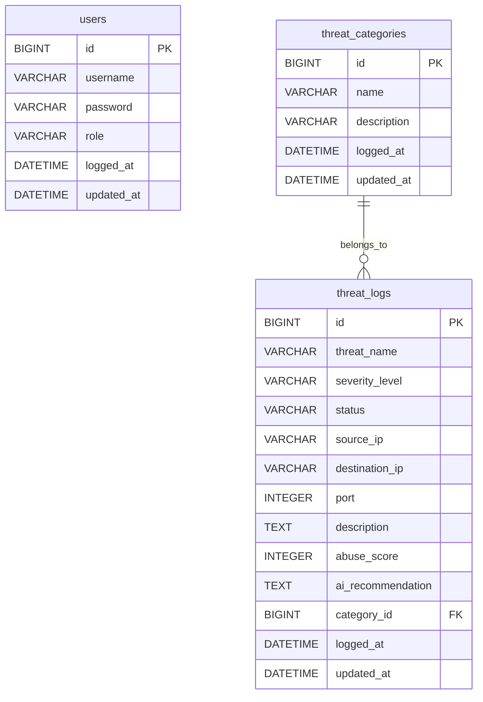

# 🛡️ Security Threat Archive (보안 위협 아카이브)

> **인공지능(Gemini AI) 및 위협 인텔리전스(Threat Intelligence)가 융합된 실시간 보안 침해 사고 기록 및 분석 플랫폼**
> 
> 본 프로젝트는 기업의 보안 관제 센터(SOC) 및 보안 팀이 네트워크 상에서 발생하는 다양한 침해 사고를 실시간으로 기록하고, 외부 평판 데이터 조회 및 AI 조치 권고사항 자동 생성을 통해 신속하게 침해 대응(Incident Response)을 수행할 수 있도록 돕는 관제 지원 솔루션입니다.
> 
> 🎵 **Development Note (Vibe Coding)**
> * 본 프로젝트는 인공지능과 대화하며 소프트웨어를 구축하는 **'바이브 코딩(Vibe Coding)'의 개념을 탐구하고 학습하기 위한 공부 용도**로 기획 및 진행되었습니다.
> * 프로젝트의 기획, 요구사항 구체화, DB 모델링, 백엔드 로직 설계, 보안 기능(JWT), 실시간 스트리밍(SSE), 외부 API 연동, UI/UX 수정 및 배포에 이르기까지 **모든 개발 빌드 과정은 순수하게 바이브 코딩(Vibe Coding)만을 이용하여 100% 진행**되었습니다.

---

## 🖥️ 서비스 미리보기 & UI 레이아웃

* **대시보드 통계**: 전체 위협 및 등급별 실시간 감지 통계 제공.
* **아코디언 드롭다운 상세 보기**: 각 로그 항목 클릭 시 테이블 내에서 슬라이드 오픈되며 **상세 기술 분석 내용** 및 **AI 대응 가이드** 출력.
* **실시간 필터링**: 전체 심각도 및 등록된 카테고리를 활용해 화면 갱신 없이 실시간으로 조건별 로그 검색.
* **보안 보고서 다운로드**: 한글 깨짐이 없는 Excel 호환 UTF-8 BOM 방식의 CSV 보안 보고서 추출.

---

## 🛠️ Technology Stack (기술 스택)

### Backend
* **Language & Runtime**: Java 21 (JDK 21)
* **Framework**: Spring Boot 3.x / 4.x
* **Security**: Spring Security & Spring Security JWT (JSON Web Token)
* **Data Access**: Spring Data JPA (Java Persistence API), Hibernate
* **Database**: MariaDB 11.x (Connector/J)
* **Libraries**: `RestTemplate` (외부 API 통신)

### Frontend
* **Core**: Semantic HTML5, Vanilla JavaScript (ES6+)
* **Styling**: Vanilla CSS (CSS Variables, Glassmorphism, Responsive Grid System)
* **Real-time Pipeline**: EventSource (Server-Sent Events)
* **Interceptors**: Native Fetch API Interceptor (JWT Token Auto-Inject & 401 Authentication Handler)

### AI & Threat Intelligence API
* **AI Engine**: Google Gemini 1.5 Flash API (Stable v1)
* **Reputation Intelligence**: AbuseIPDB API v2 (Check API Endpoint)

---

## 💡 Key Features & Implementation Intent (핵심 기능 및 구현 의도)

### 1. 데이터 모델 및 관제 메타데이터 세분화 (DB & Modeling)
* **구현 의도**: 실제 보안 사고 기록으로 가치를 갖기 위해 단순 줄글 형태의 로그에서 탈피하여 출발지/목적지 IP, 포트, 처리 상태(`DETECTED`, `ANALYZING`, `RESOLVED`, `FALSE_POSITIVE`) 등의 핵심 메타데이터를 추가 구축했습니다.
* **성능 최적화**: 위협 로그와 카테고리 테이블 조회 시 JPA Fetch Join 연산을 사용해 다대일 관계에서 흔히 발생하는 **N+1 쿼리 조회 성능 저하 문제**를 근본적으로 해결했습니다.

### 2. Spring Security & JWT 기반 권한 제어 (RBAC)
* **구현 의도**: 보안 데이터의 무결성을 지키고 불필요한 노출을 막기 위해 역할 기반 접근 제어(Role-Based Access Control)를 구현했습니다.
* **역할군 설계**:
  * `ROLE_ADMIN` (관리자): 위협의 입력, 수정, 삭제뿐 아니라 카테고리 설정까지 포함한 전체 CRUD 및 시스템 통제 권한 보유.
  * `ROLE_ANALYST` (분석가): 위협 로그의 조회, 입력, 수정 권한을 보유하며, 데이터 삭제 및 시스템 카테고리 관리는 불허.
  * `ROLE_USER` (조회 전용): 대시보드 화면 및 필터링 기능 조회를 허용하나, 등록 폼 및 제어 버튼은 UI에서 격리.

### 3. 실시간 SSE 동기화 및 알림 파이프라인 (SSE Real-Time Sync)
* **구현 의도**: 초 단위로 흘러가는 보안 관제 환경에서는 주기적인 화면 새로고침(Polling)이 리소스 낭비와 대응 지연을 초래합니다.
* **설계**: SSE(Server-Sent Events) 파이프라인을 구축해 다른 담당자가 위협을 새로 등록하거나 조치 상태를 변경하는 순간, 브라우저가 화면 새로고침 없이 **실시간 테이블 업데이트 및 위협 경고 토스트 알림**을 즉시 수신하도록 설계했습니다.

### 4. 위협 인텔리전스 실시간 연동 (AbuseIPDB Integration)
* **구현 의도**: 등록되는 공격자 IP의 실시간 평판 조회를 통해 알려진 위협인지를 자동으로 가려냅니다.
* **설계**: `RestTemplate`을 사용하여 공격자 IP 등록 시 AbuseIPDB 글로벌 위협 서버로 REST API 통신을 보내 해당 IP의 **누적 신고 기반 악성 위험 점수(Abuse Confidence Score)**를 백엔드에서 실시간 조회하여 데이터베이스에 함께 적재합니다.
* **안정성 (Self-Healing)**: 외부 API 서버 장애 혹은 네트워크 단절 시 시스템 전체가 마비되는 것을 막기 위해 자체 해시 알고리즘 기반의 **Fallback 안전장치**를 이중 적용했습니다.

### 5. Google Gemini AI 자동 대응 플레이북 생성 (AI Automation)
* **구현 의도**: 관제 요원이 침해 사고 발생 시 당황하지 않고 즉각 조치할 수 있도록 대응 가이드를 인공지능이 자동 작성해 줍니다.
* **설계**: Google Gemini 1.5 Flash 모델 API를 백엔드에 통합하여, 새로운 보안 로그가 수집되면 AI가 위협 명칭과 유형을 분석하고 **"방화벽 정책 설정, 계정 제어 방법, 시스템 취약점 조치 단계"**를 마크다운 기반의 행동 수칙(Mitigation Playbook)으로 즉각 작문하여 데이터베이스에 기록하고 화면에 시각화합니다.

---

## 📊 Database ER-Diagram (데이터베이스 스키마 구조)



---

## 🚀 시작하기 (How to Run)

### 1. 요구사항
* **Java**: JDK 21 이상
* **Database**: MariaDB 10.5 이상 혹은 MySQL 8.0 이상
* **Build Tool**: Gradle 8.x

### 2. 데이터베이스 설정
MariaDB에 접속하여 프로젝트 백엔드가 사용할 데이터베이스를 생성합니다.
```sql
CREATE DATABASE security_db;
```

### 3. 설정 파일 작성 (API 키 포함)
1. `src/main/resources/` 폴더 내부의 `application.properties.template` 파일명을 `application.properties`로 변경합니다.
2. 아래 템플릿에 맞추어 본인의 DB 정보 및 API 키를 입력합니다.
```properties
# DB 설정
spring.datasource.url=jdbc:mariadb://localhost/security_db?createDatabaseIfNotExist=true
spring.datasource.username=본인_DB_계정
spring.datasource.password=본인_DB_비밀번호

# API 키 설정
abuseipdb.api.key=본인의_AbuseIPDB_API_키
gemini.api.key=본인의_Google_Gemini_API_키
```

### 4. 어플리케이션 실행
프로젝트 루트 디렉토리에서 아래 명령어를 실행하여 서버를 가동합니다. (기본 포트: **`8082`**)
```bash
./gradlew bootRun
```
브라우저를 열어 **`http://localhost:8082`**에 접속합니다.

---

## 🔒 테스트용 시드 계정 정보
데이터베이스 실행 시 `data.sql` 스크립트를 통해 아래의 테스트용 계정이 자동으로 생성됩니다:

| 계정 ID (Username) | 비밀번호 (Password) | 부여된 역할 (Role) | 주요 권한 범위 |
| :--- | :--- | :--- | :--- |
| **admin** | admin123 | `ROLE_ADMIN` | 전체 CRUD 권한 + 카테고리 관리 |
| **analyst** | analyst123 | `ROLE_ANALYST` | 위협 로그 기록 및 수정 (삭제 불가) |
| **user** | user123 | `ROLE_USER` | 실시간 대시보드 및 아코디언 조회 전용 (등록 폼 숨김) |
