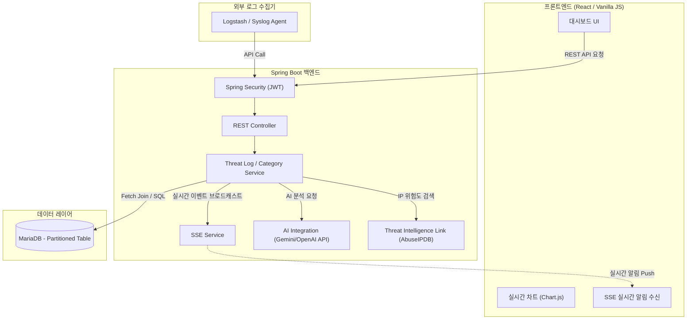

# 🛡️ Security Threat Archive 고도화 아이디어 제안서

현재 구현된 **Security Threat Archive(보안 위협 아카이브)**는 Spring Boot 3.x/4.x 기반의 3-Tier 아키텍처와 JPA Fetch Join을 이용한 N+1 문제 해결 등 견고한 기본기를 갖춘 프로젝트입니다. 

이 시스템을 실제 현업 보안 관제(SOC) 및 보안 아카이브 시스템 수준으로 확장하고 완성도를 극대화하기 위한 **5가지 영역의 고도화 아이디어**를 제안합니다.

---

## 💡 1. 데이터베이스 및 데이터 모델 고도화 (DB & Modeling)

현재 데이터 모델은 위협의 명칭, 분류, 심각도, 단순 설명만 저장하고 있어 실제 침해 사고 분석에 활용하기에는 정보가 제한적입니다.

* **침해 사고 메타데이터 세분화**:
  * 공격지 IP (`source_ip`), 목적지 IP (`destination_ip`), 포트 번호 (`port`) 컬럼 추가.
  * 공격 상태(Status) 관리 필드 추가: `DETECTED` (탐지), `ANALYZING` (분석 중), `RESOLVED` (조치 완료), `FALSE_POSITIVE` (오탐).
* **변경 이력 관리 (Audit Log)**:
  * 특정 위협 로그의 심각도나 상태가 변경되었을 때, 누가 언제 어떻게 수정했는지 기록하는 `threat_log_history` 테이블 설계.
* **대용량 로그 처리를 위한 데이터베이스 튜닝**:
  * 위협 로그 데이터는 실시간으로 대량 축적되므로, MariaDB의 **파티셔닝(Partitioning)** 기능을 활용해 월별/일별로 테이블을 분할하여 조회 성능 유지.
  * 검색이 자주 발생하는 `severity_level` 및 `logged_at` 필드에 인덱스(INDEX) 설계.

---

## 🔒 2. 백엔드 아키텍처 및 보안 고도화 (Backend & Security)

관제 대시보드 특성상 보안과 실시간 전송이 매우 중요합니다.

* **Spring Security & JWT 기반 권한 제어 (RBAC)**:
  * 아무나 로그를 삭제/수정할 수 없도록 로그인 및 권한 검증 구현.
  * `ROLE_ADMIN` (카테고리 생성/삭제 및 시스템 설정), `ROLE_ANALYST` (위협 로그 CRUD), `ROLE_USER` (로그 조회 전용)로 역할 분리.
* **실시간 위협 전송 (SSE 또는 WebSockets)**:
  * 프론트엔드에서 주기적으로 API를 호출(Polling)하지 않고, 새로운 위협 로그가 DB에 저장되는 즉시 화면에 실시간 팝업 및 업데이트가 되도록 **SSE (Server-Sent Events)** 파이프라인 구현.
* **Threat Intelligence (외부 보안 API) 연동**:
  * 공격지 IP가 등록될 때 백엔드에서 외부 오픈 API(예: AbuseIPDB, VirusTotal)를 호출하여 해당 IP의 위험 점수(Abuse Score)를 함께 조회 및 아카이브에 자동 기록.

---

## 🎨 3. 프론트엔드 및 사용자 경험 고도화 (Frontend & UX/UI)

사용자가 직관적으로 보안 위협 동향을 파악할 수 있도록 대시보드 시각화 기능을 강화합니다.

* **인터랙티브 차트 및 대시보드 다이어그램**:
  * `Chart.js` 또는 `D3.js`를 연동하여 **카테고리별 위협 비율(Pie Chart)**, **시간대별 발생 추이(Line Chart)**를 대시보드 상단에 시각화.
* **고급 필터링 및 검색**:
  * 기간 필터(최근 1시간, 24시간, 1주일, 한 달) 및 다중 조건 검색(심각도별 + 카테고리별 + 검색어) 기능 제공.
* **보안 보고서 다운로드 (Export)**:
  * 현재 대시보드에 필터링된 위협 목록을 **CSV, Excel 또는 PDF 보고서** 형태로 즉시 다운로드할 수 있는 기능 제공.
* **컴포넌트 기반 프레임워크 전환**:
  * 추후 화면 기능 확장을 고려하여 React 또는 Next.js로 프론트엔드를 전환하고 상태 관리(State Management)를 체계화.

---

## ⚙️ 4. 운영 및 모니터링 자동화 (DevOps & Automation)

인적 입력 방식에서 자동 수집 및 모니터링 환경으로 전환합니다.

* **자동 로그 수집기(Collector) 연동**:
  * 수동 입력 외에도 Spring Boot의 `Logback` 로그나 외부 방화벽/WAS의 Syslog를 읽어 백엔드 API로 자동 인서트하는 가상 에이전트 파이프라인(예: Logstash 또는 단순 Batch Job) 구성.
* **애플리케이션 모니터링**:
  * `Spring Boot Actuator`를 활성화하고 `Prometheus`와 `Grafana`를 연동하여 서버 CPU, 메모리, DB 커넥션 풀 상태를 실시간 시각화.

---

## 🤖 5. AI & 지능형 분석 기능 도입 (AI Integration)

최신 AI 기술을 활용하여 위협 대응을 돕습니다.

* **LLM 기반 대응 가이드 자동 생성**:
  * 새로운 위협 로그를 등록할 때 OpenAI/Gemini API를 호출하여, 해당 공격 기법(예: Ping of Death)의 구체적인 **방어 가이드 및 조치 방안 권고사항**을 AI가 자동 작성하여 상세 설명에 기본 제공하는 기능.
* **이상 징후 탐지 (Anomaly Detection)**:
  * 특정 시간대에 비정상적으로 특정 등급의 공격 로그가 폭증하는 패턴을 통계적으로 감지하여 시스템 경고 알림 발생.

---

## 🗺️ 향후 아키텍처 제안 (Future Architecture)

고도화가 완료된 시스템의 아키텍처 흐름은 다음과 같습니다.

---

## 📅 단계별 로드맵 제안 (Roadmap)

| 단계 | 목표 | 주요 작업 내용 | 예상 난이도 |
| :--- | :--- | :--- | :--- |
| **1단계: 데이터 내실화** | DB 모델 고도화 및 검색 강화 | IP 정보 추가, 복합 필터 검색 및 차트 시각화 (Chart.js) | 하 (Low) |
| **2단계: 보안 및 실시간성** | 권한 제어 및 실시간 관제 | Spring Security(JWT) 도입, SSE 기반 실시간 위협 전송 | 중 (Medium) |
| **3단계: 지능화 및 자동화** | AI 연동 및 자동 수집 | 외부 Threat Intel API 연동, LLM API 연동 조치 가이드 자동화 | 상 (High) |

> [!NOTE]
> 본 아이디어 제안서는 현재 작성된 구조를 최대한 보존하면서, 점진적으로 추가 모듈(Security, SSE, AI)을 붙이거나 테이블 구성을 확장하는 방향으로 설계되었습니다.
