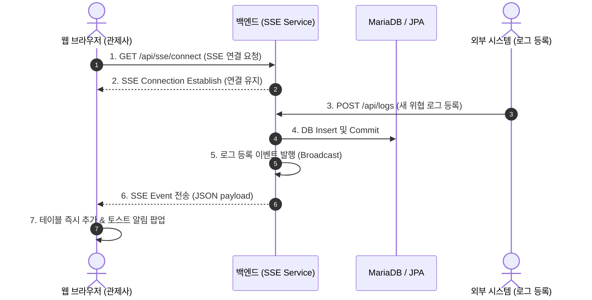

# 📝 2단계: 보안 및 실시간성 (Spring Security & SSE) 설계서

본 문서는 **2단계: 보안 및 실시간성** 구현을 위한 상세 설계 및 코드 변경 계획서입니다. 실시간 위협 전송(SSE)과 접근 권한 제어(Spring Security)를 구현하기 위한 백엔드 구조 및 프론트엔드 연동 계획을 다룹니다.

---

## 📡 1. SSE (Server-Sent Events) 실시간 관제 시스템 설계

사용자가 대시보드를 열어두고 있는 동안, 새로운 보안 위협이 감지(DB 저장)되면 화면을 새로고침하거나 폴링하지 않고 즉시 화면에 알림이 표시되고 테이블에 추가되도록 합니다.

### 1) 백엔드 변경 계획
* **`SseController.java` (신규)**:
  * 클라이언트의 SSE 연결을 맺는 `/api/sse/connect` 엔드포인트 제공.
  * `SseEmitter`를 반환하며 연결을 유지합니다.
* **`SseService.java` (신규)**:
  * 여러 클라이언트(`SseEmitter` 목록)를 동시 메모리 관리.
  * 타임아웃 및 에러 발생 시 리스트에서 자동 제거하는 예외 처리 구현.
  * `broadcast(ThreatLogDto logDto)` 메서드를 제공하여 새로운 로그가 들어오면 접속한 모든 브라우저에 이벤트를 발송합니다.
* **`ThreatLogService.java`**:
  * `save()` 메서드 완료 후 `sseService.broadcast(new ThreatLogDto(saved))`를 호출하도록 로직 추가.

### 2) 프론트엔드 연동 계획
* **`app.js`**:
  * 웹 페이지 로드 시 `/api/sse/connect` 경로로 `EventSource` 연결 수립.
  * `EventSource.onmessage` 이벤트 수신 핸들러 추가:
    * 수신한 JSON 데이터를 기존 `logs` 배열의 맨 앞에 삽입.
    * 대시보드 상단 통계 수치(`HIGH`, `MEDIUM`, `LOW` 개수) 즉시 재계산 및 업데이트.
    * 테이블 렌더링 함수(`renderLogTable()`)를 호출하여 화면 갱신.
    * 화면 우측 상단에 5초간 유지되다 사라지는 **토스트 알림(Toast Notification)**을 동적으로 생성하여 노출.
* **`index.html` & `style.css`**:
  * 실시간 토스트 알림 창이 뜰 수 있는 컨테이너 및 애니메이션 스타일(fade-in, slide-up) 추가.

---

## 🔒 2. Spring Security & JWT 기반 권한 제어 설계

아무나 위협 아카이브의 정보를 보거나 위협을 삭제할 수 없도록 인증/인가 장치를 구축합니다.

### 1) 역할(Role) 및 접근 권한 정의
1. **`ROLE_USER` (일반 관제 직원)**: 위협 로그 조회 기능만 허용 (`GET /api/logs/**`)
2. **`ROLE_ANALYST` (보안 분석가)**: 위협 로그 등록 및 수정 가능 (`POST/PUT /api/logs/**`)
3. **`ROLE_ADMIN` (관리자)**: 위협 로그 삭제 및 카테고리 관리 권한 보유 (`DELETE /api/logs/**`, `/api/categories/**`)

### 2) 백엔드 변경 계획
* **`build.gradle` 의존성 추가**:
  * `implementation 'org.springframework.boot:spring-boot-starter-security'`
  * `implementation 'io.jsonwebtoken:jjwt-api:0.12.5'` (JWT 토큰 생성/검증 라이브러리)
* **`SecurityConfig.java` (신규)**:
  * REST API 접근 허용 및 필터 체인(Filter Chain) 구성.
  * 세션을 사용하지 않는 `SessionCreationPolicy.STATELESS` 정책 설정.
  * 로그인 경로(`/api/auth/login`) 및 정적 파일 경로(HTML, CSS, JS)는 인증 제외.
* **`JwtTokenProvider.java` / `JwtAuthenticationFilter.java` (신규)**:
  * 토큰 발급 및 HTTP Request 헤더(`Authorization: Bearer <JWT>`) 검증 필터 구현.
* **`User.java` / `UserRepository.java` (신규)**:
  * 사용자 계정 정보(username, password, role) 테이블 매핑.

### 3) 프론트엔드 연동 계획
* 로그인하지 않은 사용자는 대시보드가 아닌 **로그인 화면(Login Page)**을 띄우도록 모달 또는 별도 페이지 구성.
* 로그인 완료 시 서버로부터 받은 JWT 토큰을 `localStorage`에 저장.
* 모든 Fetch API 요청 헤더에 `Authorization: Bearer <Token>`을 실어 전송하도록 `app.js` 비동기 통신 로직 래핑.

---

## 📅 개발 순서 제안 (Implementation Strategy)

두 가지 대형 작업을 안정적으로 진행하기 위해 **단계를 세분화하여 진행**할 것을 추천합니다.

1. **2-1단계 (실시간성 먼저)**: **SSE 실시간 위협 관제 및 토스트 알림** 구현.
   * 백엔드에 Spring Security가 없는 상태에서 SSE의 작동(동작성)을 먼저 확인하므로 디버깅이 매우 쉽고 시각적 만족도가 높습니다.
2. **2-2단계 (보안 적용)**: **Spring Security 및 JWT 권한 관리** 도입.
   * 인증 필터 및 JWT 로직을 구축하고 프론트엔드에 로그인 모달/API 요청 인터셉터 기능을 연동합니다.

---

### 진행 승인 요청
위 세부 단계(2-1단계 실시간성 먼저 진행 또는 2단계 전체 한 번에 진행) 중 **원하시는 방향**을 알려주시면 즉시 구현에 착수하겠습니다!
