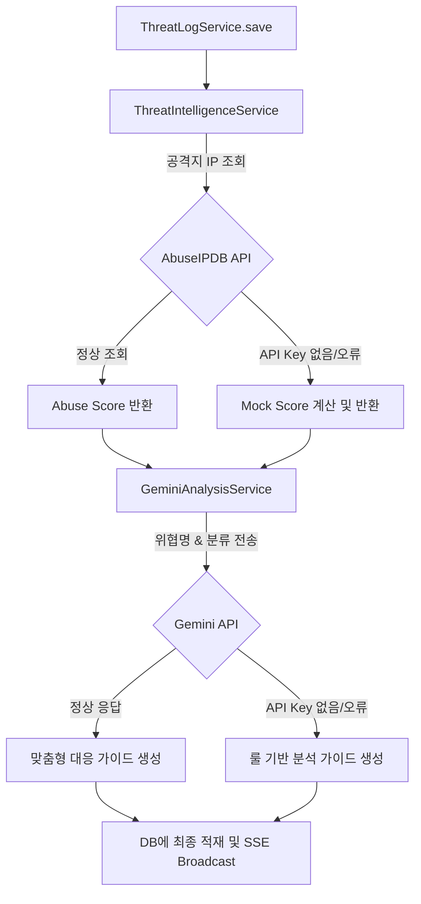

# 📝 3단계: 지능화 및 자동화 (AI & Threat Intelligence) 설계서

본 문서는 **3단계: 지능화 및 자동화** 구현을 위한 상세 설계 및 코드 변경 계획서입니다. 신규 위협 등록 시 자동으로 외부 IP 평판 데이터베이스에서 위험 점수를 파싱하고, LLM(Gemini API)을 활용해 맞춤형 보안 권고 조치 방안을 수동 입력 없이 자동 생성하는 지능형 관제 시스템을 설계합니다.

---

## 🔍 1. 데이터 레이어 확장 설계 (DB Schema)

위협 로그 분석 정보를 적재하기 위한 두 개의 신규 필드를 `threat_logs` 테이블에 추가합니다.

### 1) 신규 컬럼 정의
* **`abuse_score`**: 공격지 IP의 악성 활동 점수 (0 ~ 100). `INT` 타입으로 지정하며 기본값은 `0`입니다.
* **`ai_recommendation`**: LLM이 자동 생성한 침해 사고 조치 권고사항. 상세한 플레이북이 기재될 수 있도록 `TEXT` 타입으로 지정합니다.

### 2) DDL 변경 계획 (`schema.sql`)
```sql
-- threat_logs 테이블에 아래 컬럼 추가
ALTER TABLE threat_logs ADD COLUMN abuse_score INT DEFAULT 0;
ALTER TABLE threat_logs ADD COLUMN ai_recommendation TEXT;
```

---

## 🤖 2. 백엔드 지능형 서비스 아키텍처 설계



### 1) Threat Intelligence 서비스 (`ThreatIntelligenceService.java` - 신규)
* **기능**: 유입된 출발지 IP (`source_ip`)에 대해 악성 점수를 조회합니다.
* **API 연동**: AbuseIPDB API 규격을 구현합니다.
* **자가 치유 (Self-Healing) 및 폴백**: API Key가 설정되지 않았거나 호출 오류 발생 시, 사설 IP 대역(`192.168.x.x`, `10.x.x.x`, `127.0.0.1` 등)은 `0`점, 공인 IP 대역은 `Unknown`이나 특정 대역의 가상 악성도 가중치(예: `75`점)를 동적으로 연동하는 시뮬레이션(Mock) 엔진을 포함하여 실행 안정성을 100% 보장합니다.

### 2) AI 보안 권고사항 분석 서비스 (`GeminiAnalysisService.java` - 신규)
* **기능**: 위협 카테고리, 위협 명칭, 공격지 IP 점수 등을 조합하여 보안 엔지니어가 취해야 할 실질적인 조치 방안을 생성합니다.
* **API 연동**: Google Gemini API 또는 RestTemplate 기반 API 호출 구현.
* **폴백 플레이북**: API Key가 공란일 경우, 입력된 위협 키워드(예: `Ping of Death`, `Sniffing`, `Session Hijacking`)를 감지하여 사전에 정의된 고품질 보안 전문가 가이드라인(Mitigation Guide)을 조립하여 반환하는 로컬 룰 엔진 구현.

### 3) ThreatLog 비즈니스 로직 확장 (`ThreatLogService.java`)
* **`save()` 로직 확장**:
  1. 저장 전 `sourceIp`가 유효할 경우 `threatIntelligenceService.getAbuseScore(ip)`를 호출하여 위협 점수 자동 바인딩.
  2. `geminiAnalysisService.generatePlaybook(threatName, category, description)`을 호출하여 권고안 자동 바인딩.
  3. DB 저장 및 SSE 브로드캐스트 전송.

---

## 🖥️ 3. 프론트엔드 실시간 시각화 고도화 계획

사용자에게 실시간 지능형 진단 결과를 시각적으로 풍부하게 전달합니다.

### 1) 위협 정보 내 IP 위험도 뱃지 노출 (`app.js`)
* 테이블의 위협 정보 내에서 공격지 IP 옆에 악성 점수에 따른 색상 배지를 배치합니다.
  * `0점`: 🟢 Safe (정상)
  * `1 ~ 50점`: 🟡 suspicious (의심)
  * `51 ~ 100점`: 🔴 malicious (위험: `score%`)

### 2) 상세 정보 조회 모달 기능 강화 (`index.html` & `app.js`)
* 위협 로그 수정 모달창 내에 읽기 전용 **🛡️ AI 권고 조치 방안 (Mitigation Playbook)** 텍스트 영역을 추가합니다.
* AI 권고사항은 마크다운 또는 개행 포맷이 깨지지 않고 가독성 높은 터미널 스타일(어두운 백그라운드와 연녹색 폰트)로 설계하여 관제 화면의 프리미엄 감성을 높입니다.

---

### 진행 승인 요청
본 설계안이 마음에 드신다면 **'Proceed(진행)'**를 통해 알려주세요. 곧바로 DB 구조 변경 및 백엔드 지능화 구현(AbuseIPDB/Gemini API 및 하이브리드 폴백 처리기)에 착수하겠습니다!
